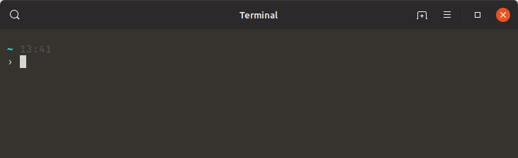
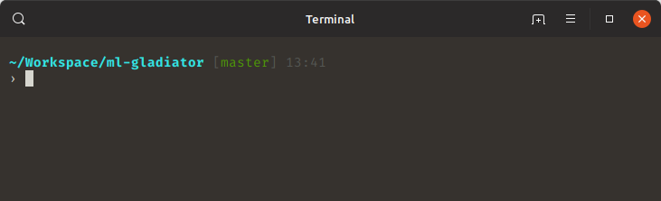
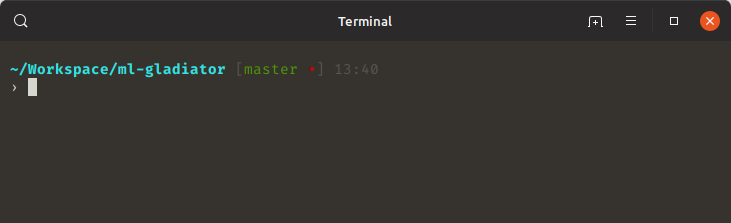
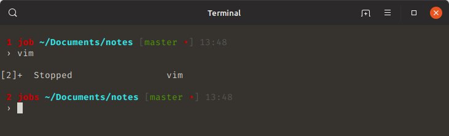
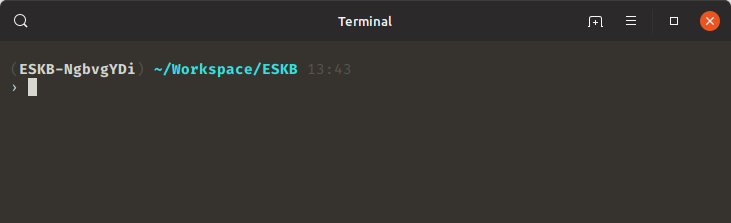
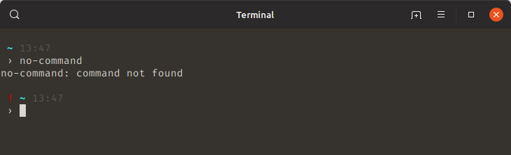
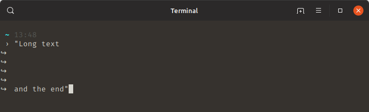
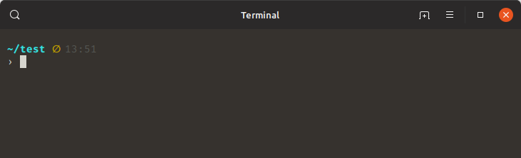
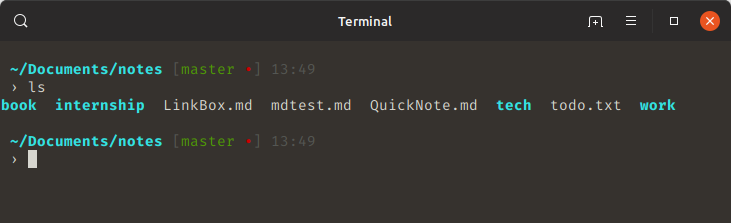

# Better Bash

My custom bash configuration that I find it worth to share.

## Features

 - Vibrant colors with symbolic unicode sugar, minimal footprint and time

   

 - Git support

   

   

 - Background jobs indicator

   

 - Virtual environment support

   

 - Return value indicator

   

 - Custom PS2

   

 - Empty directory

   

 - Custom `ls` colors

   

## Installation

For fresh install run:

```sh
mkdir ~/.betterbash
cd ~/.betterbash
git clone https://github.com/orcantiryaki/better-bash.git
./install
```

Your existing `.bashrc` and `.bash_aliases` files will be backed up to `.bashrc.bak`
and `.bash_aliases.bak`.
